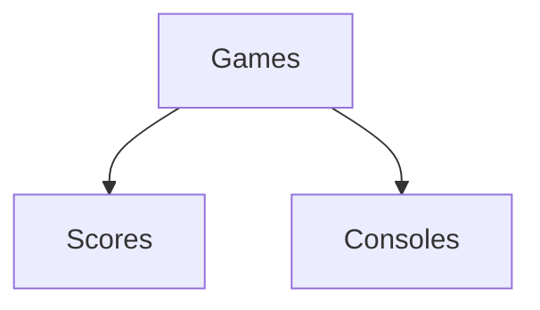

# 10-02-2023
## Start the project
1. routine React cleanup  
2. ISSUE: GitHub and Modules Ignored
   - run `npm install modules` to install the modules locally 
3. `Users.jsx` component created for authentication
4. `Routes` added 
   - 'App.js' ; 'index.js' 
5. Firebase set up
   - `Login` connected successfully
   - `Sign Up` connected successfully

# 12-02-2023
1. routes cleaned up 
   - Home added to routes
   - Contents only displayed after the click of a button 
2. Game component created

   - Parent component: Games 
     - callback function: api; clicked answers; score calculation 
   - Child components:
     - Console: display each question 
     - Scores: display the score of the game
3. Anonymous login added 
4. Log out added to the Home 
5. `npm i react-firebase-hooks` for the manipulation of Firebase usercredentials 
6. `npm install --save react-dropdown-select` for dropdown selection

# 13-02-2023
1. To display a question at a time 
    ```mermaid 
   flowchart TD
   parent[Quizs] --> child1[Game Board]
   parent --> child2[Consoles]
    ```
   - Parent component: 1) talk to API 2) store all questions in the state]
   - Child component: 1) receive all the questions in the sate 2) have a current variable in the state to display one question at e]

# 14-02-2023
1. Realtime Database setup in Firebase 
    ```
    {
        "rules": {
        ".read": "now < 1678885200000",  // 2023-3-16
        ".write": "now < 1678885200000",  // 2023-3-16
        "players":{
        "$uid":{
        ".write":"auth != null && auth.uid == $uid", // only the player in session can write
        "score":{
        ".write":"auth != null && auth.uid == $uid" // only the player in session can write
        }
        }
        }
        }
        }

   ```