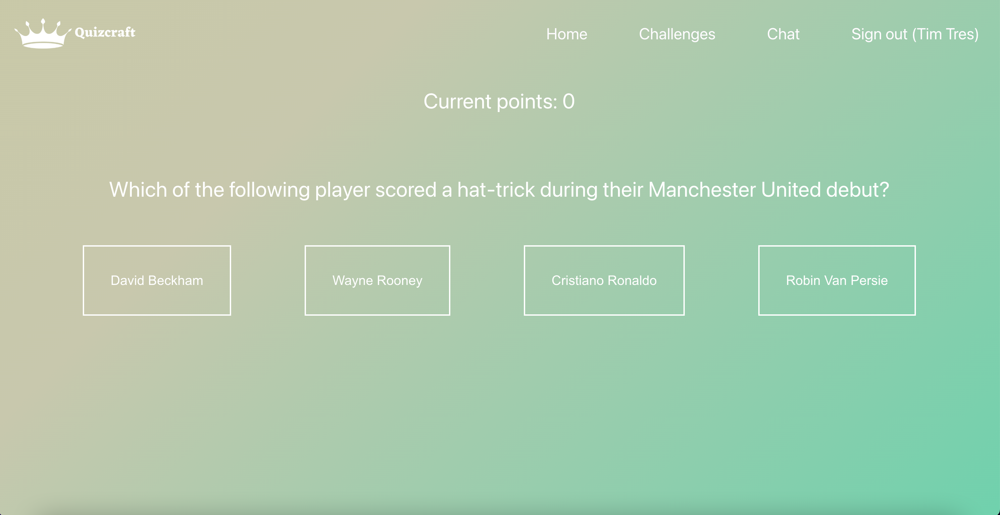
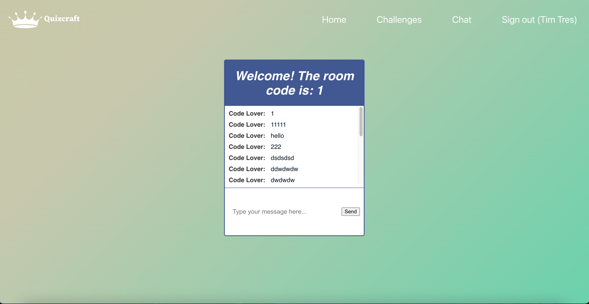
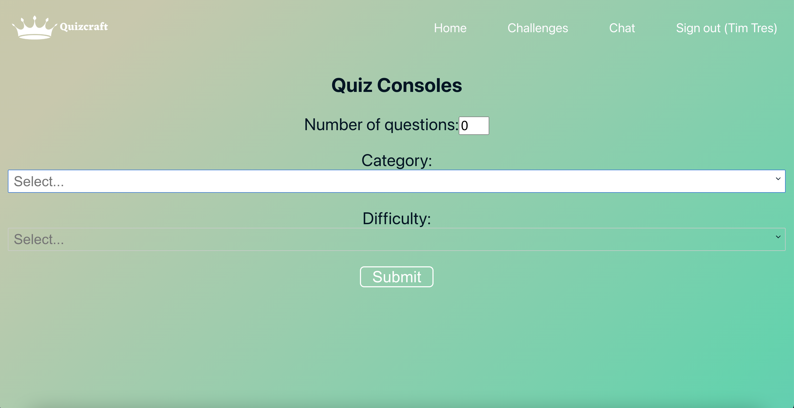
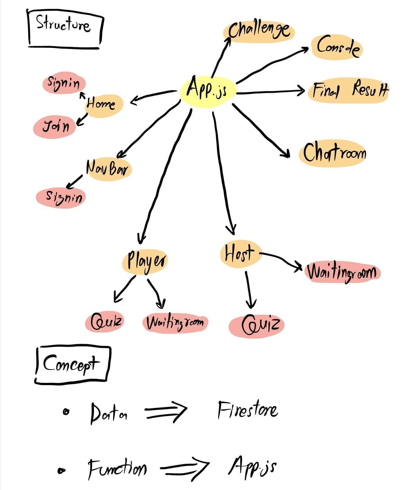
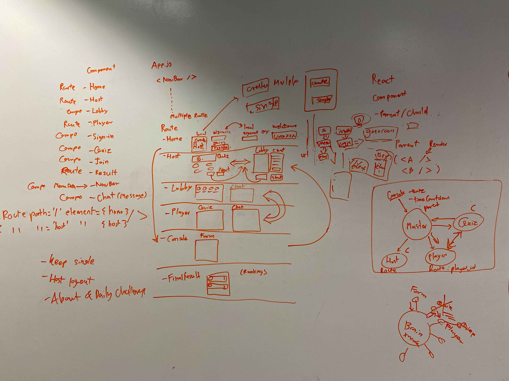

# :left_speech_bubble: QuizCraft

Get ready for an exhilarating adventure of knowledge and excitement with [QuizCraft](https://quizcraft-c8706.web.app/), the ultimate multiplayer quiz game. Challenge your friends across various topics, prove your trivia prowess, and create unforgettable memories. Play now and embark on the journey of a lifetime!

### How it works
- Create a room to play with friends by sending the room id to the friends to join.
- Chat room also required room id to enter.
- The host is the one who clicks to change the question when ready.

## About this project
- Group project with 4 people to collaborate and submit within 5 days including 1 day presentation.

## Built with
- React.js
- HTML
- CSS/SCSS
- Firebase
- Deployed on Firebase

### Snapshots
|Quiz|
|:-:|
||
|Chatroom|
||
|Create Quiz|
||

---

## :bell: Putting it all together

### :bulb: Features:
- Multiplayer trivia game that can be played together at the same time.
- Score summary at the end of the game.
- Different interface for the host and players.
- Chatroom for the game.
- Single-player mode which changes the color when answering (Red for wrong and green for right answer).
- Question from Trivia API.
- Store players, host, chats, and trivia on Firebase.

### :spiral_calendar: Challenges:
- Multiplayer game concept to work on Firebase as we have to decide between a real-time database vs Firestore and eventually we chose Firestore as it met the needs and it is much simpler to set up.
- React component design and planning were challenging as we kept redesigning multiple times.
   - We misunderstood the React parent/child component concept as we tried to make one parent as a brain to deal with all child components in one layer (get data from the child component and pass it to the other child component) which did not work for this concept.
   - Therefore, we finalise the concept again as below:

|Concept|Draft|
|:-:|:-:|
| | |

### :book: Lessons:
- Multiplayer is not like we expected in our heads. It is like getting/updating all data and visualise it in one go.
- Design NoSQL on Firebase was confusing but after you have tried to set it up, you will understand the way to structure it and how to deal with it.
- It is convenient to setup user login and signup using Firebase.

### :bookmark: Future updates:
- Countdown time within the question and force quiz change after it ends.
- Fix all CSS and make it mobile-friendly.
- Fix multiplayer answer to change the colour for the choices and also show scores during the game for the player.
- Add score summary and ranking within the quiz change phase.
- Add score summary page for single player.
- Remove all chat history when the room has been removed or the game end.
